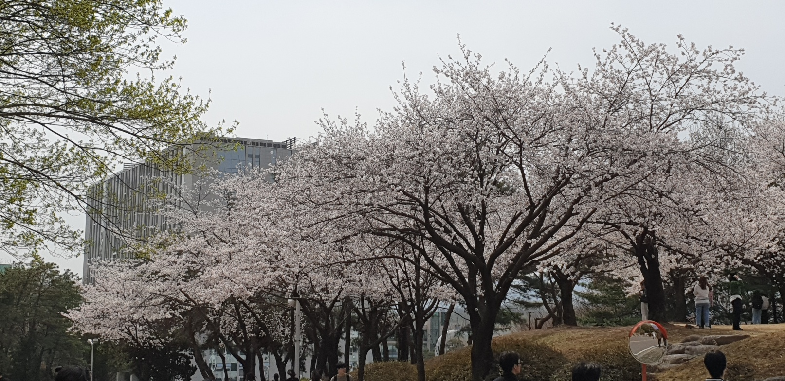
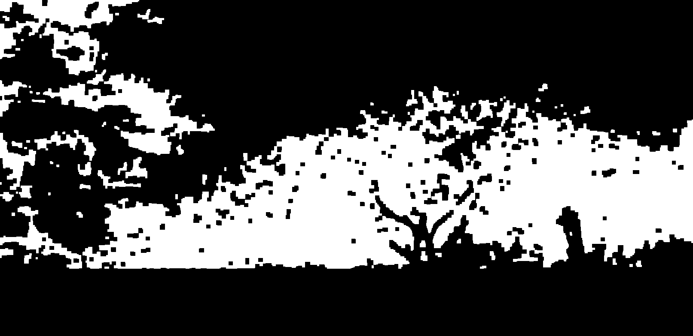
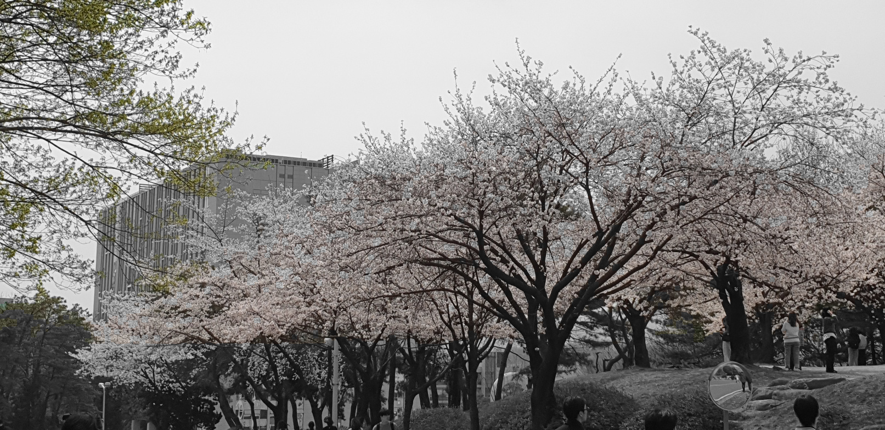

# 👤 Kim Sejung (201935020)
## AR Face Filter Project 
## 1. 프로젝트 개요 (Project Overview)
This project is a real-time Augmented Reality (AR) application developed using **Python**, **OpenCV**, and **MediaPipe**. The system detects faces and hands through a webcam to apply dynamic digital filters and enable touchless interaction. 

It goes beyond simple overlays by implementing advanced computer vision techniques such as:
*   **Mesh-based Face Distortion** (Liquid warp effects)
*   **Texture Mapping** (Face painting that adheres to skin)
*   **Physics-based Particle Systems** (Interactive elements)
*   **Hand Gesture Recognition** (Touchless UI control)

## 2. 데모 영상 (Demo)


> *Note: If the video above does not play, please check the file at `Sejung/videos/rec_20251211_123859.mp4`.*

---

## 3. 주요 기능 (Key Features)

### 🎭 Advanced Face Filters
1.  **Face Distortion (Big Eyes)**
    *   Uses localized mesh warping to enlarge eyes in real-time.
    *   Adjustable distortion strength and radius.
2.  **Face Painting (Joker)**
    *   Applies texture directly onto the face mesh (lips, eyes) using polygon rendering.
    *   The makeup moves naturally with facial expressions.
3.  **Interactive Particles**
    *   Opening the mouth triggers a physics-based fire particle system.
4.  **2D Accessories**
    *   Overlays glasses, hats, and crowns aligned with specific facial landmarks.

### 🖐 Gesture Control Interface
Control the application without touching the keyboard:
*   **✌️ V-Sign**: Take a Screenshot
*   **🖐️ Palm**: Navigate Menu (Next Item)
*   **✊ Fist**: Select / Deselect Item
*   **☝️ Index Point**: Change Virtual Background

### 🖼️ Virtual Backgrounds
*   Replaces the real background with **Blur**, **Solid Colors**, or **Pattern Images** using Selfie Segmentation.

---

## 4. 설치 및 패키지 정보 (Installation & Requirements)

### Environment
*   **Python 3.8+**

### Required Packages (with versions)
The following packages are required. You can install them via `pip`.

| Package | Version | Usage |
| :--- | :--- | :--- |
| `opencv-python` | >= 4.5.0 | Image processing & Computer Vision |
| `mediapipe` | >= 0.8.9 | Face Mesh, Hands, Selfie Segmentation |
| `numpy` | >= 1.19.0 | Matrix operations & Geometric calcs |
| `pillow` | >= 8.0.0 | Korean text rendering & Image handling |

**Installation Command:**
```bash
pip install opencv-python mediapipe numpy pillow
```

---

## 5. 실행 방법 (Usage)

This project is located in the `Sejung` directory.

1.  **Navigate to the project directory:**
    ```bash
    cd Sejung
    ```

2.  **Run the main script:**
    ```bash
    python main.py
    ```

### 🎮 Control Guide
| Key | Function |
| :--- | :--- |
| **A / D** | Navigate Menu (Left / Right) |
| **Space** | Toggle Filter |
| **Tab** | Change Background |
| **S** | Save Screenshot |
| **R** | Start/Stop Recording |
| **+ / -** | Adjust Filter Size |
| **[ / ]** | Adjust Filter Transparency |

---

## 6. 참고 자료 (References)
*   **Google MediaPipe Solutions**: [https://developers.google.com/mediapipe/solutions](https://developers.google.com/mediapipe/solutions)
    *   Used for Face Mesh, Hands, and Selfie Segmentation models.
*   **OpenCV Documentation**: [https://docs.opencv.org/](https://docs.opencv.org/)
    *   Referenced for `warpAffine`, `remap`, and image processing functions.
*   **NumPy Documentation**: [https://numpy.org/doc/](https://numpy.org/doc/)
    *   Referenced for vector arithmetic and mask operations.

---
# 👤 Lee JoonKyo (201935111)
## ColorPaletteGen 🎨  
이미지 기반 컬러 팔레트 생성기

## 1. 프로젝트 개요 (Overview)

**ColorPaletteGen**은 이미지에서 대표 색상들을 추출하여  
- RGB / HEX 코드 목록  
- 컬러 팔레트 이미지  

를 자동으로 생성해주는 오픈소스 도구입니다.  

디자이너, 개발자, 프레젠테이션 제작자 등  
이미지 기반 색 조합이 필요한 사용자를 위해 설계된 간단한 CLI 도구입니다.

---

## 2. 데모 (Demo)

아래는 예시 형식입니다.  

### 입력 이미지 예시
`images/input/sample1.jpg`


### 출력 팔레트 예시
`images/result/palette_sample1.png`


### 터미널 출력 예시

```
$ python -m src.cli --image images/input/sample1.jpg --k 5 --output images/result/sample1_palette.png

=== Extracted Colors ===
1: RGB=(26, 115, 165), HEX=#1A73A5
2: RGB=(215, 234, 248), HEX=#D7EAF8
3: RGB=(53, 148, 190), HEX=#3594BE
4: RGB=(158, 202, 229), HEX=#9ECAE5
5: RGB=(96, 180, 214), HEX=#60B4D6
Palette saved to: images/result/sample1_palette.png
```

---

## 3. 설치 방법 (Installation)

### 요구 환경
- Python 3.10 이상 권장
- pip

### 의존성 설치

```
pip install -r requirements.txt
```

사용 라이브러리:
- opencv-python  
- numpy  
- scikit-learn  
- Pillow  

---

## 4. 실행 방법 (Usage)

### 기본 실행

```
python -m src.cli --image examples/sample1.jpg
```

- 기본 색상 개수: 5  
- 출력 파일: `palette.png`

### 옵션 포함 실행

```
python -m src.cli --image examples/sample1.jpg --k 8 --output out.png --json colors.json
```

#### 옵션 설명
| 옵션 | 설명 |
|------|------|
| `--image` | 입력 이미지 경로 (필수) |
| `--k` | 추출할 대표 색상 개수 (기본 5) |
| `--output` | 팔레트 이미지 저장 경로 |
| `--json` | 색상 정보 JSON 저장 경로 |

---
# Yun JiWoong (201935088)

---

# Pyramid vs Direct Blending (OpenCV)

이 프로젝트는 Gaussian Pyramid와 Laplacian Pyramid를 이용한 이미지 블렌딩(Pyramid blending)과  
단순 절반 병합 방식(Direct blending)을 비교하여 시각적으로 어떤 차이가 있는지 보여주는 간단한 오픈소스 SW입니다.

---

## Features
- OpenCV 기반 Pyramid blending 구현
- Direct blending과 결과 비교
- 이미지 크기 자동 조정 기능
- 명령행 실행 방식 제공

---

## How to Run

### 1. Install dependencies

```pip install -r opencv-python```
```pip install -r numpy```

### 2. Run blending

```python pyramid_blending.py --img1 examples/apple.jpg --img2 examples/orange.jpg```


결과는 `outputs/` 폴더에 저장됩니다.
- Pyramid_blending.jpg  
- Direct_blending.jpg  

---

## 🖼 예시 결과


---

## Reference
- OpenCV Python Tutorials
- Laplacian Pyramid Blending (Burt and Adelson, 1983)
---
# 👤 Lee Chanwook (202033757)

## Tree Segmentation (벚꽃 나무 세그멘테이션)

간단한 이미지 세그멘테이션을 통해 나무/꽃 영역만 컬러로 남기고 배경을 흑백으로 만드는 프로젝트입니다.

## 1. 프로젝트 개요

이 프로젝트는 캠퍼스에서 찍은 **벚꽃 나무 사진**에서  
나무 + 꽃 영역만 컬러로 유지하고, 나머지 배경은 흑백으로 만드는  
간단한 **이미지 세그멘테이션(Tree Segmentation)** 예제입니다.

- 입력: `examples/input/campus_trees.jpg` (벚꽃 나무 사진)
- 출력:
  - 나무 + 꽃 영역 마스크 (흑백 이미지)
  - 나무 + 꽃만 컬러로 남기고 배경을 흑백으로 만든 결과 이미지

OpenCV의 색 공간 변환(HSV), 엣지 검출, 이진화(Threshold)를 이용해  
하늘 영역을 제거하고, 나무/꽃 영역만 남기도록 마스크를 생성한 뒤  
원본 이미지와 합성해서 결과를 만듭니다.

---

## 2. 데모 / 예시 이미지

### (1) 입력 이미지

벚꽃 나무가 포함된 원본 이미지입니다.



---

### (2) 나무 + 꽃 마스크 (흑백)

나무와 꽃이 있는 영역을 흰색(255), 나머지는 검은색(0)으로 나타낸 마스크입니다.



---

### (3) 최종 Tree Segmentation 결과

마스크를 이용해 **나무 + 꽃 영역은 컬러**, 나머지 배경은 **흑백**으로 만든 결과입니다.



---

## 3. 사용한 패키지와 버전

- Python 3.10
- OpenCV (opencv-python)
- NumPy
- Matplotlib

```
pip install -r requirements.txt
```
위 명령 한 줄로 필요한 패키지를 한 번에 설치할 수 있습니다.


## 4. 실행 방법

프로젝트 루트에서 아래 명령을 실행하세요:

```
pip install -r requirements.txt
python main.py
```

## 5. 참고 자료

OpenCV 공식 문서 – Image Processing, Color Spaces, Thresholding

수업 시간에 제공된 OpenCV 예제 코드 및 강의 자료

위 자료들을 참고해 색 공간 변환(HSV), 엣지 검출(Laplacian),
이진화(threshold)와 마스크 합성 방법을 응용하여 구현했습니다.
